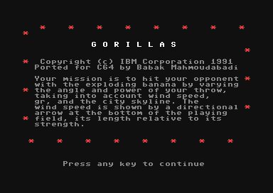
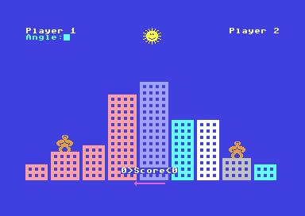

# Gorillas-C64

I have recently bought a C64 and I was so surprised that my programs on the cassette still work after over 20 years. I found some unfinished projects, including Gorillas, and decided to finish them since there is nothing better than finishing an unfinished project. ;)
-
 Copyright (C) IBM Corporation 1991 
 Ported for C64 by Babak Mahmoudabadi 
 
 Your mission is to hit your opponent with the exploding banana
 by varying the angle and power of your throw, taking into account
 wind speed, gravity, and the city skyline. 
  

 

